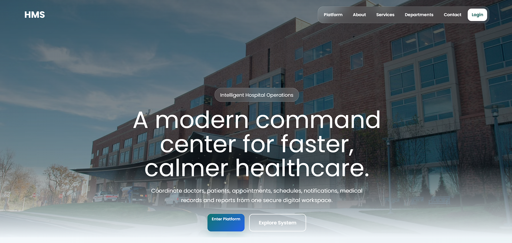
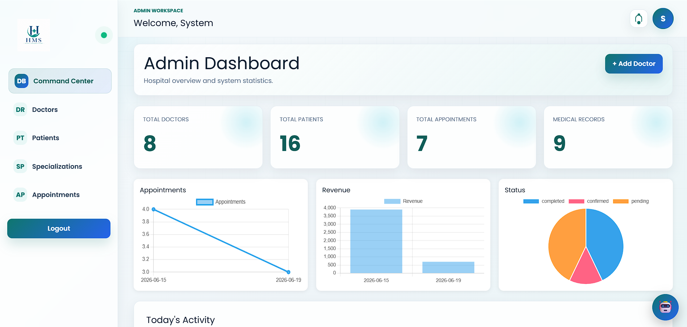
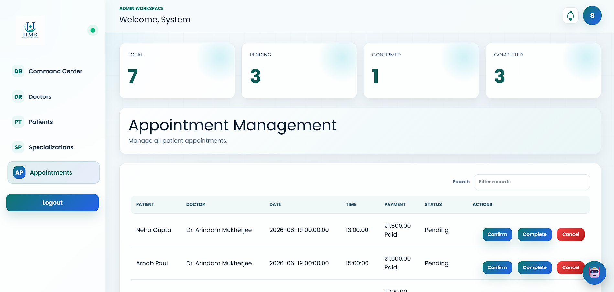
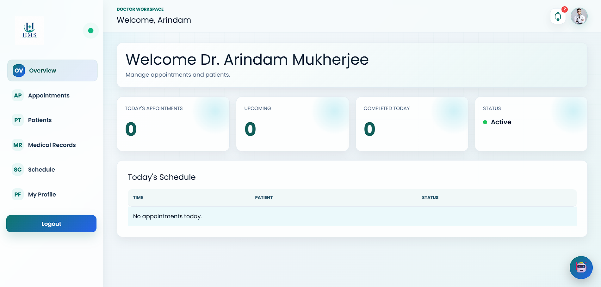
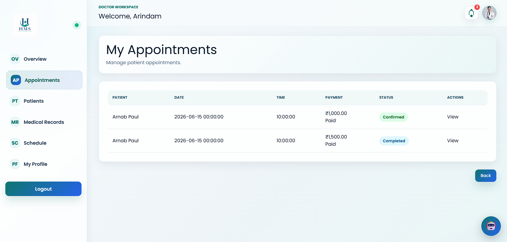
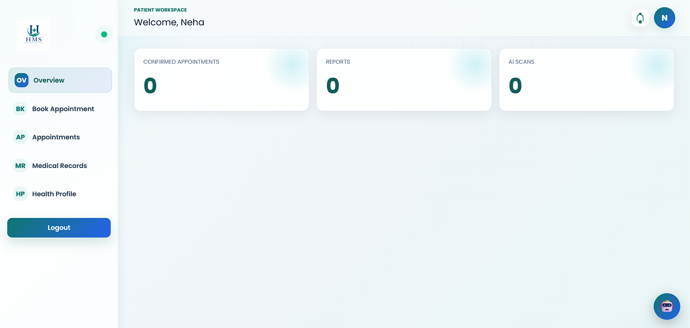
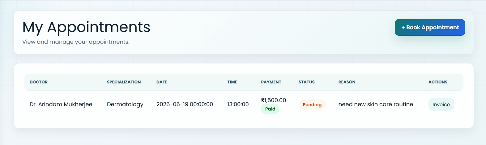
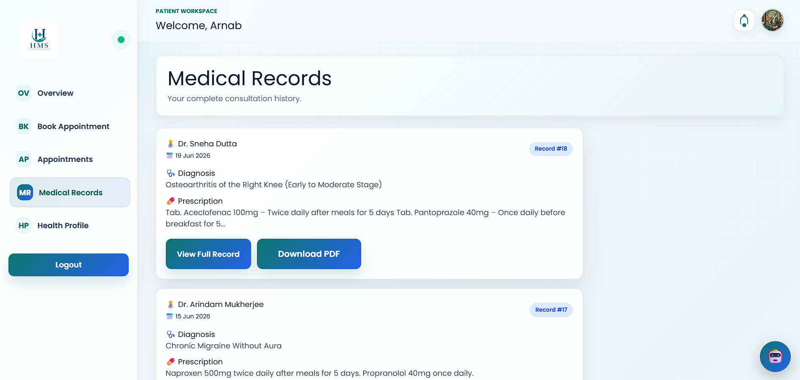
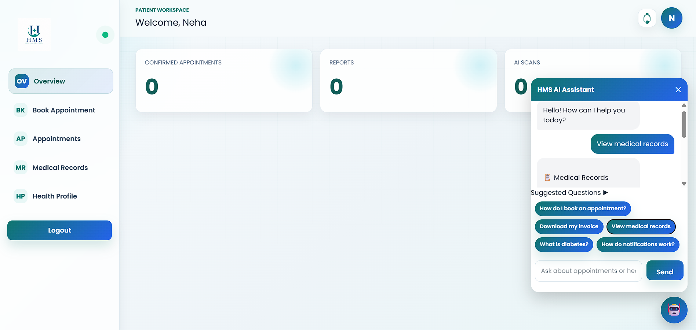
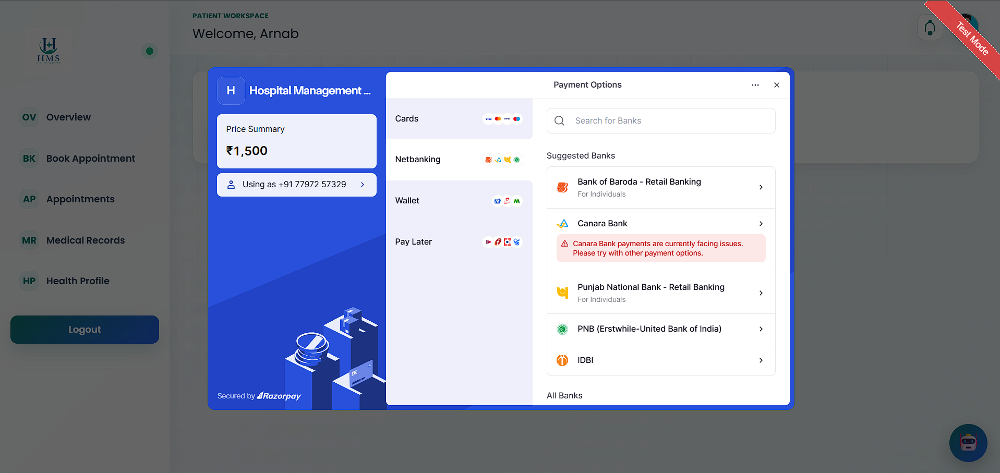

# 🏥 Hospital Management System

A full-featured Hospital Management System built with Laravel, MySQL, and modern web technologies. The platform streamlines hospital operations by providing dedicated dashboards for Administrators, Doctors, and Patients while integrating AI assistance, secure online payments, medical record management, and PDF reporting.


---

## 🌐 Live Demo

**Production URL**

https://hms-portal.ddns.net

---

## ✨ Key Highlights

* Multi-role authentication system
* Admin, Doctor, and Patient dashboards
* AI-powered healthcare assistant
* Online appointment booking
* Razorpay payment integration
* Medical record management
* Doctor scheduling system
* Notification center
* PDF invoice generation
* Medical report export
* Responsive mobile-friendly design
* AWS EC2 deployment

---

# 📸 Screenshots

## 🏠 Home Page



---

## 👨‍💼 Admin Panel

### Admin Dashboard



### Appointment Management



---

## 👨‍⚕️ Doctor Panel

### Doctor Dashboard



### Appointment Management



---

## 👤 Patient Panel

### Patient Dashboard



### Appointment Booking & History



### Medical Records



---

## 🤖 AI Assistant

The integrated AI assistant helps patients navigate the system, understand appointments, and receive healthcare guidance.



---

## 💳 Online Payment Integration

Secure appointment payments powered by Razorpay.



---

# 🏗 System Architecture

### Administrator

* Manage doctors
* Manage patients
* Manage appointments
* Manage specializations
* View analytics
* Generate reports

### Doctor

* Manage appointments
* Create medical records
* Upload signature
* Manage availability
* View patient history

### Patient

* Book appointments
* Pay online
* View medical records
* Download invoices
* Receive notifications

---

# 🤖 AI Assistant

The system includes an AI-powered assistant integrated using the Groq API.

### Capabilities

* Appointment guidance
* Patient support
* Medical record assistance
* Health education
* Quick action suggestions
* Hospital navigation help

---

# 💳 Payment System

Integrated with Razorpay for secure online transactions.

### Features

* Appointment payments
* Payment verification
* Transaction tracking
* Invoice generation

---

# 🛠 Technology Stack

## Backend

* Laravel 12
* PHP 8.2+
* MySQL

## Frontend

* Blade Templates
* CSS3
* JavaScript
* Vite

## APIs & Services

* Groq AI API
* Razorpay API

## Infrastructure

* AWS EC2
* Apache2
* Ubuntu Server

---

# 🚀 Installation Guide

## 1. Clone Repository

```bash
git clone https://github.com/Arnxb007/Hospital_Management_System.git

cd Hospital_Management_System
```

## 2. Install Dependencies

```bash
composer install

npm install
```

## 3. Configure Environment

```bash
cp .env.example .env

php artisan key:generate
```

Update the following values:

```env
APP_NAME="Hospital Management System"

DB_DATABASE=
DB_USERNAME=
DB_PASSWORD=

GROQ_API_KEY=

RAZORPAY_KEY_ID=
RAZORPAY_KEY_SECRET=
```

## 4. Database Setup

Using migrations:

```bash
php artisan migrate
```

Or import SQL backup:

```bash
mysql -u username -p database_name < hospital_management.sql
```

## 5. Storage Link

```bash
php artisan storage:link
```

## 6. Build Frontend Assets

Development:

```bash
npm run dev
```

Production:

```bash
npm run build
```

## 7. Start Application

```bash
php artisan serve
```

Application:

```text
http://127.0.0.1:8000
```

---

# 🔒 Security Features

* Authentication
* Role-Based Authorization
* CSRF Protection
* Input Validation
* Secure File Uploads
* Protected Medical Records

---

# 📈 Future Roadmap

* Email Notifications
* SMS Alerts
* Telemedicine Module
* Mobile Application
* Multi-Hospital Support
* Advanced Analytics
* Doctor Video Consultation

---

# 👨‍💻 Developer

Arnab

Computer Science Engineering Student

Focused on building secure, scalable, and practical healthcare management solutions using Laravel and modern web technologies.

---

# 📜 License

Licensed under the MIT License.

See the LICENSE file for more information.
